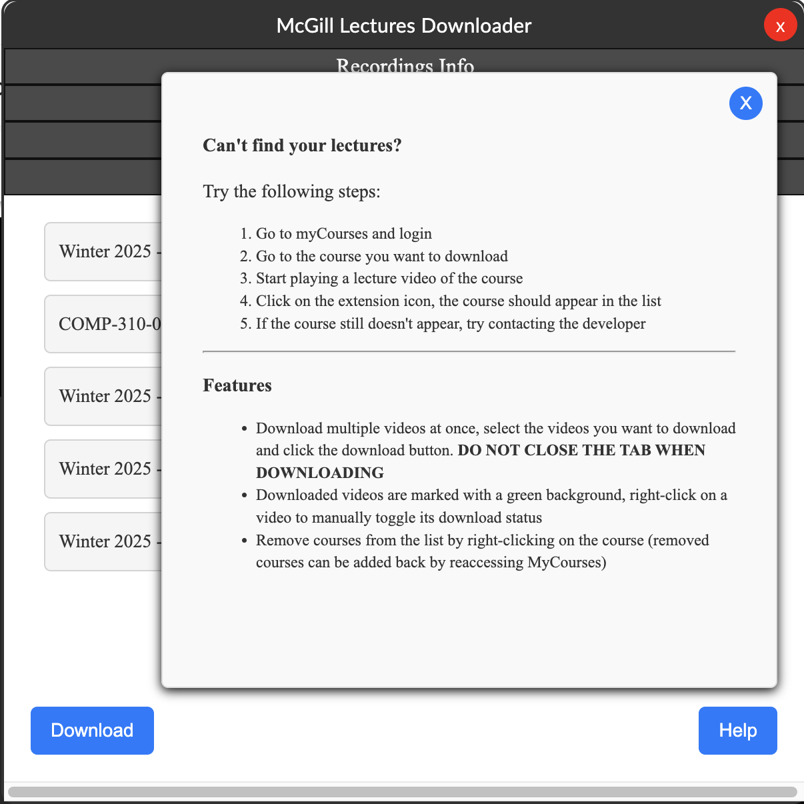
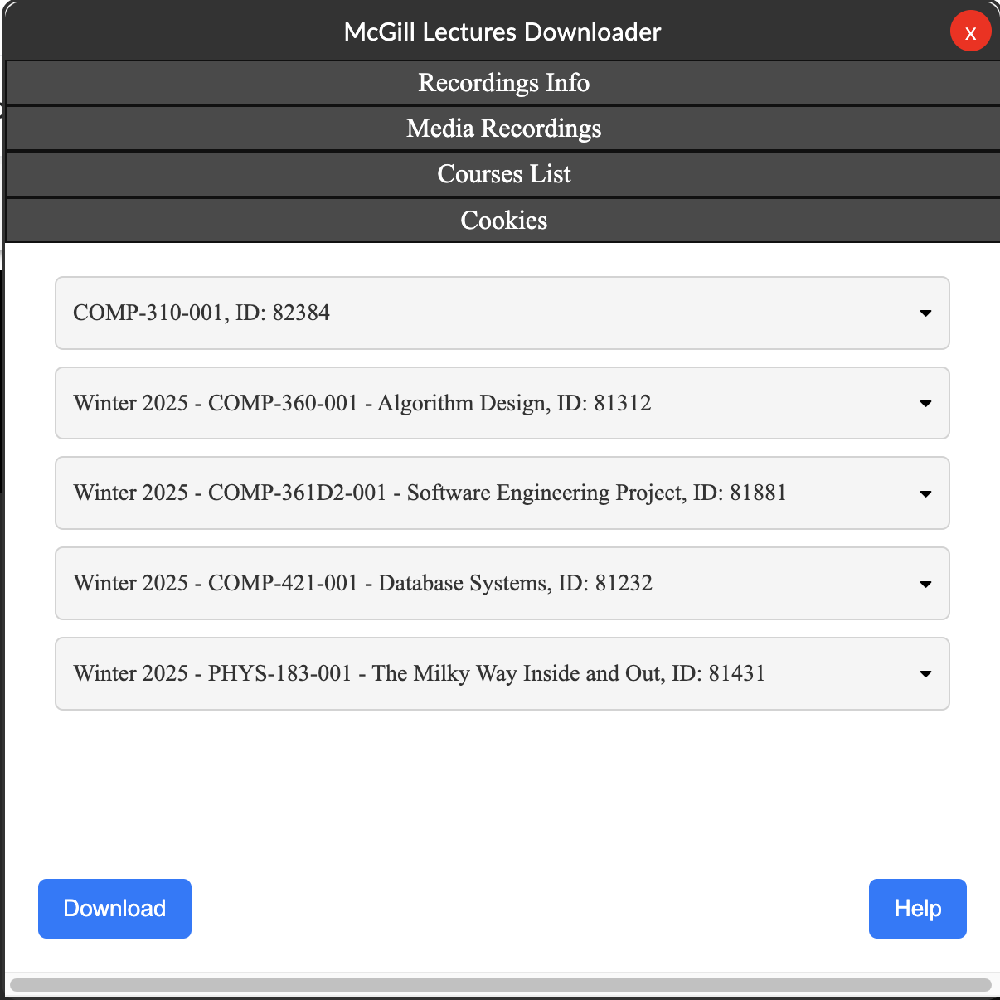
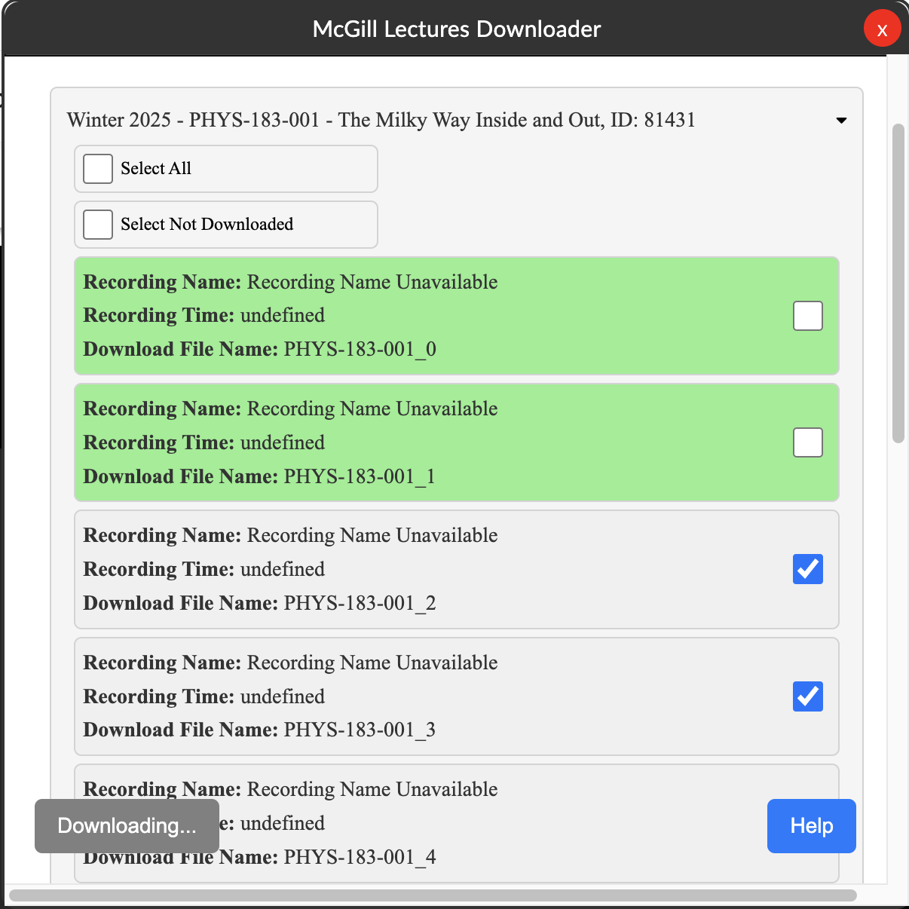

> [!CAUTION]
> This extension is still under development. It may contain bugs and has not been thoroughly tested.

# McGill Lecture Downloader Chrome Extension

This Google Chrome extension lets you download McGill's myCourses platform lecture recordings. Follow the instructions below to install and use the extension correctly.

   
   
   

## Installation Guide

### Step 1: Download the Extension
1. Navigate to the **Releases** section of the repository.
2. Download the latest **ZIP** file containing the extension.
3. A [Google Chrome extension](https://chromewebstore.google.com/detail/mclecture/ipnhkfogmlokecmpgjhdkkibomgbjmlb) has been posted, and you may download it from the Google Extension Store. However, the Google Extension Store may have an outdated version due to a Google verification process.

### Step 2: Install on Chrome
1. Open Google Chrome and enter `chrome://extensions/` in the address bar.
2. Enable **Developer mode** by toggling the switch in the top-right corner.
3. Extract the downloaded **ZIP** file to a folder on your computer.
4. Click the **Load unpacked** button on the Chrome extensions page.
5. Select the extracted folder to install the extension.

## Usage Instructions

1. **Log in to myCourses**: Open [McGill myCourses](https://mycourses2.mcgill.ca) and log in.
2. **Access the Course**: Navigate to the course containing the lecture you want to download.
3. **Play the Lecture Video**: Start playing the video for the extension to detect it.
4. **Open the Extension**: Click on the extension icon in the Chrome toolbar.
5. **Select the Course & Video**:
   - The course should appear in the extension's list automatically.
   - If the course does not appear, refresh the page or restart the extension.
   - If issues persist, contact the developer.
6. **Download Videos**:
   - Select multiple videos or an individual video.
   - Click the **Download** button.
   - **Do not close the extension while downloading**.
7. **Track Downloaded Videos**:
   - Downloaded videos will have a **green background**.
   - Right-click a video to manually toggle its download status.
8. **Remove Courses from the List**:
   - Right-click on a course to remove it from the extension’s list.
   - Removed courses can be restored by revisiting myCourses.

## Features

✔ **Batch Download**: Select multiple videos and download them at once.

✔ **Download Status Indicator**: Downloaded videos are marked with a green background.

✔ **Manual Download Toggle**: Right-click any video to mark or unmark it as downloaded.

✔ **Course Management**: Remove and re-add courses dynamically.

---

Enjoy your lectures! :)
