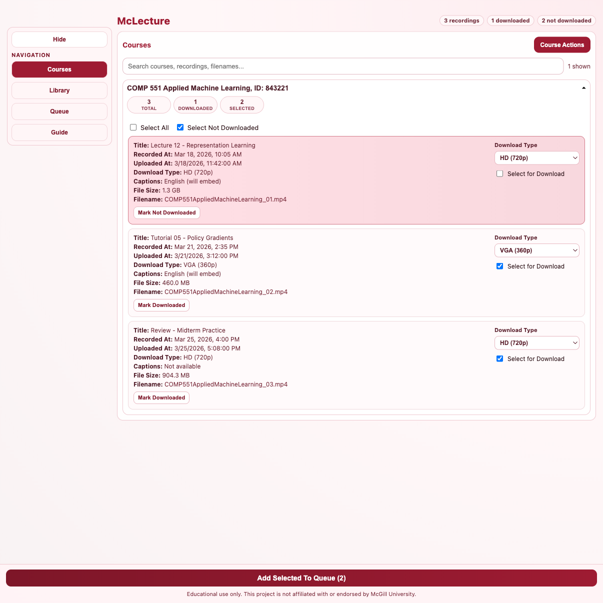
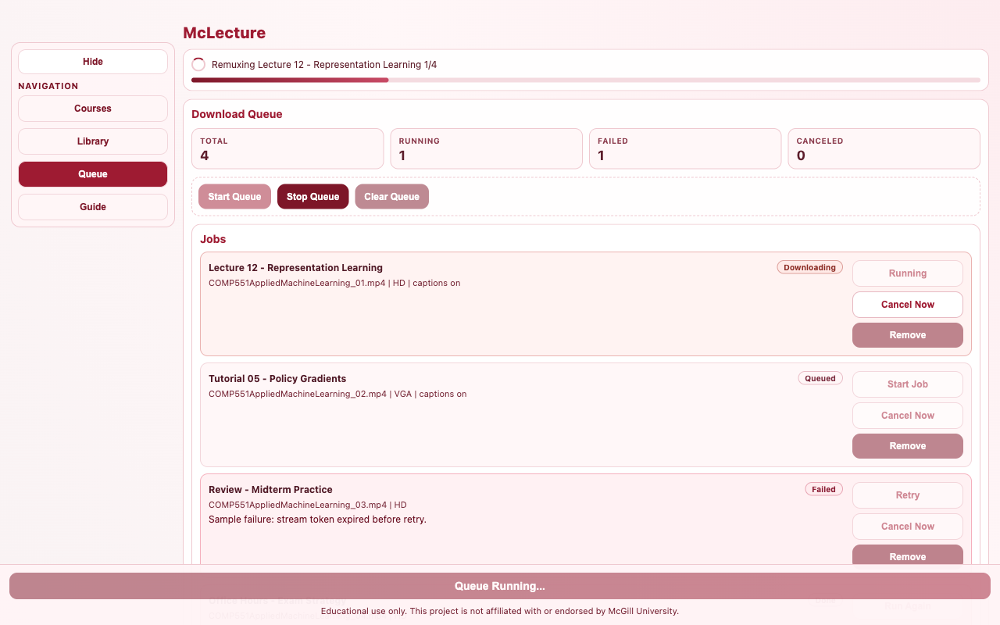
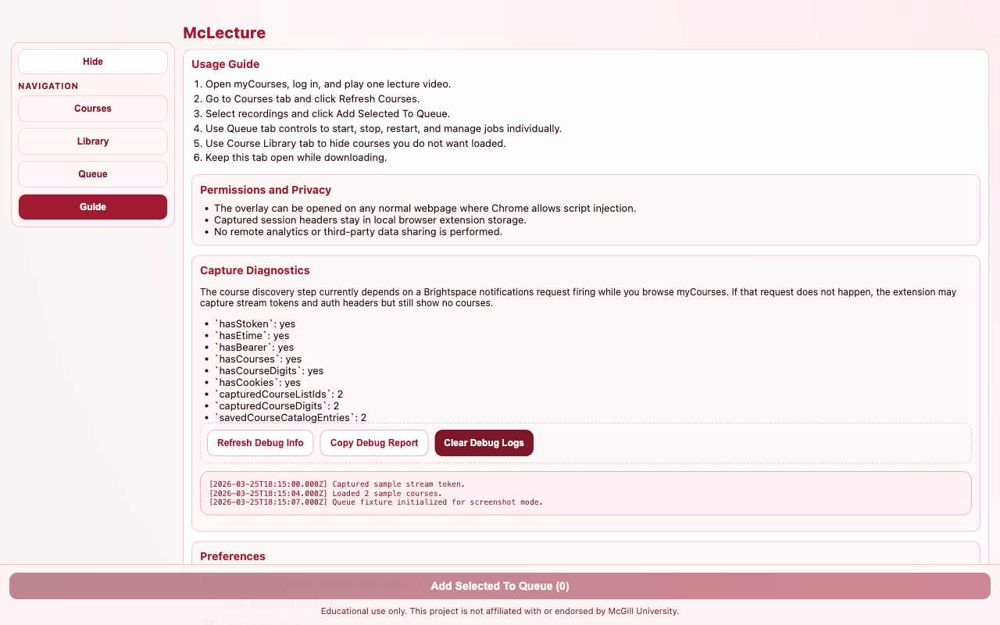

# McLecture

Chrome MV3 extension for downloading McGill myCourses lecture recordings.

[Chrome Web Store](https://chromewebstore.google.com/detail/mclecture/ipnhkfogmlokecmpgjhdkkibomgbjmlb) · [Repository](https://github.com/EnYiHou/mcgill-lecture-downloader)

<p>
  
  
  
</p>

## Tech stack

- TypeScript, React, and Vite
- Chrome Extension Manifest V3 APIs
- ESLint, Prettier, and Vitest
- Browser download flow with `.mp4` remuxing

## Development setup

1. Install dependencies:
   ```bash
   npm install
   ```
2. Build the extension:
   ```bash
   npm run build
   ```

## Build output

- Build artifacts are generated in `dist/`.

## Screenshots

Regenerate the README screenshots from fake fixture data:

```bash
npm run screenshots
```

The screenshot workflow does not use real myCourses sessions, cookies, recordings, or course data.

## Load unpacked extension

1. Open `chrome://extensions/`.
2. Enable **Developer mode**.
3. Click **Load unpacked**.
4. Select the `dist/` folder.

## User workflow

1. Open [myCourses](https://mycourses2.mcgill.ca), log in, and play at least one lecture.
2. Open a myCourses tab and click the extension action icon to inject the draggable overlay.
3. In the overlay UI:
   - expand a course
   - select videos
   - click **Download**
4. Downloads are remuxed to `.mp4` and saved by the browser.

## Troubleshooting

- Missing courses/tokens:
  - Play a lecture first, then click the extension icon again.
  - The extension depends on captured headers/cookies stored in `chrome.storage.local`.
